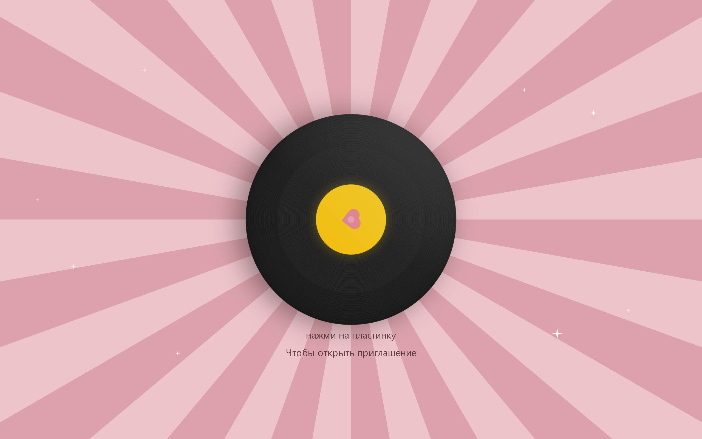

# 💍 Свадебное приглашение — Алексей и Мария


Интерактивное свадебное приглашение с анимациями, музыкой и формой RSVP.

## 🖼 Скриншот



> Стартовый экран: виниловая пластинка на розовом фоне — тап открывает приглашение
> (диско-шар, разделы «Место», «Расписание», «Дресс-код», «Подарки», RSVP).
> _Файл скриншота положить в `docs/screenshots/landing.png` (dev-сервер: `npm run dev` → http://localhost:8080)._

## ✨ Особенности

- 🎵 Музыкальное сопровождение с виниловой пластинкой на главном экране
- 🪩 Анимированный диско-шар
- 📅 Обратный отсчёт до даты свадьбы (3 июля 2026)
- 📝 Интерактивная анкета гостя (RSVP)
- 👗 Раздел с дресс-кодом
- 🎁 Информация о подарках
- 📍 Карта места проведения
- 📱 Адаптивный дизайн для мобильных устройств

## 🛠 Технологии

- **React** — UI библиотека
- **TypeScript** — типизация
- **Vite** — сборщик
- **Tailwind CSS** — стилизация
- **shadcn/ui** — компоненты интерфейса
- **React Router** — маршрутизация
- **Lucide React** — иконки

## 📅 Дата свадьбы

**3 июля 2026 года**

## 📍 Место проведения

HolidayPark — Лесная усадьба в черте города, Ижевск, Удмуртская Республика

## 🚀 Запуск проекта

```bash
# Установка зависимостей
npm install

# Запуск в режиме разработки
npm run dev

# Сборка для продакшена
npm run build
```

## 🔒 Экспорт RSVP (админ)

- Откройте страницу: https://aleksey-mariya.ru/admin
- Сначала появится окно BasicAuth (логин/пароль nginx admin).
- Затем вставьте значение `RSVP_EXPORT_TOKEN` из файла сервера:
  `/home/deploy/wedding-backend/.env`.
- Нажмите Download → скачивается `rsvp-export.json`.
- Важно: токен не отправлять гостям и не публиковать.
- Примечание: токен передаётся в заголовке `X-Export-Token`, потому что
  `Authorization` занят BasicAuth и может быть перехвачен прокси.

## 📁 Структура проекта

```
src/
├── assets/          # Изображения и GIF-анимации
├── components/      # React-компоненты
│   ├── sections/    # Секции страницы
│   └── ui/          # UI-компоненты (shadcn)
├── contexts/        # React-контексты
├── hooks/           # Кастомные хуки
├── pages/           # Страницы приложения
└── lib/             # Утилиты
```

## 💒 Разделы сайта

1. **Главная** — Приглашение с именами молодожёнов
2. **Детали** — Информация о месте и времени
3. **Дата свадьбы** — Календарь и обратный отсчёт
4. **Анкета гостя** — Форма RSVP
5. **Дресс-код** — Рекомендации по одежде
6. **Подарки** — Информация о подарках
7. **Расписание** — Программа мероприятия

---

С любовью, Алексей и Мария 💕
